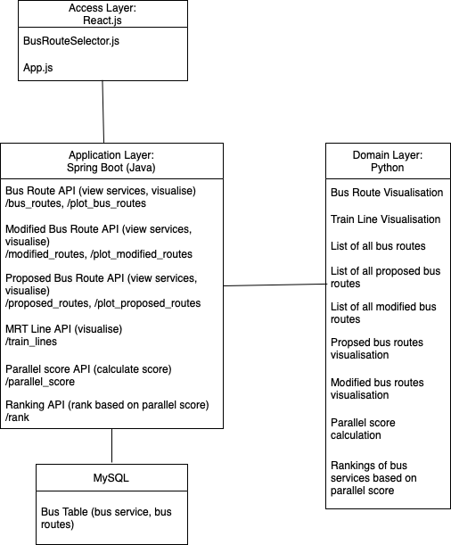
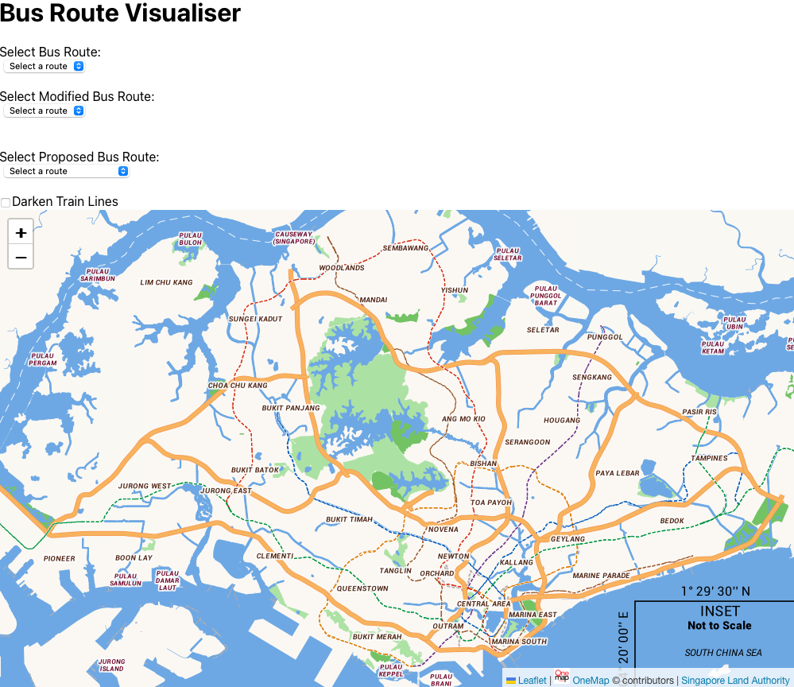

# Technical Report

**Project: LTA Geospatial Analysis**  
**Members: Eliza, Fang Ting, Krystal, Lily**  
Last updated on 29 October, 2024

## Section 1: Context

This project aims to detect trunk bus services with routes that overlap train lines so as to encourage commuters to use the MRT to get to their destination. Thereafter, we hope to remove redundant bus routes that duplicate train lines to a large degree or modify routes to cover places with less connectivity.

## Section 2: Scope

### 2.1 Problem

Currently, the problem lies in LTA introducing new MRT lines as an attempt to make public transportation more attractive to commuters. Before this, commuters relied trunk services as they cover relatively popular and long routes. Upon doing so, ridership for these trunk services dropped. As such, LTA would like to identify trunk services that are significantly parallel to MRT lines to be either removed or modified. Through streamlining transport options, budget can be utilised for other potential bus routes so that commuters can travel more conveniently.

Public transport can still be improved by identifying upcoming or current places that are experiencing a shortage of commute options. But, with a fixed amount of budget assigned to LTA, funds have to be transferred in order to incorporate these changes. 

Data science is necessary in this problem as geospatial data has to be analysed. By displaying all current bus services against train lines and thorough analysing popularity of bus services, we can construct a robust algorithm for parallel scores to identify bus routes that can potentially be removed or modified. The algorithm can be written based on factors such as how much it overlaps with train lines, how convenient the train ride is, and how many MRT stations the bus service passes through.

### 2.2 Success Criteria

*In this subsection, you should explain how you will measure or assess success for your data science project. You need to specify at least 2 business and/or operational goals that will be met if this project is successful. Business goals directly relate to the business’s objectives, such as reduced fraud rates or improved customer satisfaction. Operational goals relate to the system’s needs, such as better reliability, faster operations, etc.*

### 2.3 Assumptions

*In this subsection, you should set out the key assumptions for this data science project that, if changed, will affect the problem statement, success criteria, or feasibility. You do not need to detail out every single assumption if the expected impact is not significant.*

*For example, if we are building an automated fraud detection model, one important assumption may be whether there is enough manpower to review each individual decision before proceeding with it.*

## Section 3: Methodology

### 3.1 Technical Assumptions

*In this subsection, you should set out the assumptions that are directly related to your model development process. Some general categories include:*
* *How to define certain terms as variables*
* *What features are available / not available*
* *What kind of computational resources are available to you (ie on-premise vs cloud, GPU vs CPU, RAM availability)*
* *What the key hypotheses of interest are*
* *What the data quality is like (especially if incomplete / unreliable)*

### 3.2 Data

The datasets used were all obtained from [LTA DataMall](https://datamall.lta.gov.sg/content/datamall/en/dynamic-data.html) using API calls. To get the same datasets, run the notebook `[API Calls and Data Extraction](<API Calls and Data Extraction.ipynb>). The table below displays all datasets called.

| Dataset    | File Type         | Description  |
|:------------:|:------------:|:------------:|
| `bus_routes.csv`  | csv |  Contains details of bus stops, routes, operators, stop sequences, and bus timings (first and last bus on weekdays and weekends) for each bus service. |
| `bus_stops.csv`  | csv | Contains bus stop codes, road names, bus stop names, and geographical coordinates for all bus stops in Singapore.  |
| `bus_services.csv`  | csv | Contains data on bus operators, service directions, categories (e.g., trunk, express), origin and destination stop codes, and bus frequencies during AM and PM peak hours.  |
| m`rt_lines_shapefile.shp`  | shp | Shapefile containing coordinates of MRT lines and stations for visualization. |
| `passenger volume by bus stops`  | csv | Contains hourly passenger volumes (tap-in/tap-out) per bus stop for weekdays and weekends for July, August, and September, along with day type and time period.  |

For our interface, we used the map from [LTA's OneMap](https://www.onemap.gov.sg) to showcase our visualisations for all bus routes, MRT lines, proposed bus routes, and modified bus routes.

* *Cleaning: How did you clean the data? How did you treat outliers or missing values?*
* *Features: What feature engineering did you do? Was anything dropped?*

### 3.3 Experimental Design

Our interface is designed using a combination of Python, Java, and JavaScript. The backend was built entirely in Python, where we exposed it as a REST API using the Flask framework. All backend code can be found in `app.py`. This backend was then intergrated into our `Spring boot` application, which is written in Java. All visualisations were convered into `GeoJSON` format to enable communication between the Flask API and the Java backend, specifically within `BusController.java` and `BusVisualisationService.java`.
For the fronten, we used React.js, written in JavaScript to interact iwth the APIs. The frontend code resides in `BusRouteSelector.js` and `App.js`. Users can interact with the interace via the development server at `http://localhost:3000` once started up.

Instructions and pre-requisites for starting the interface and be found in our `README.md`.

#### API Endpoints

The table below lists the API endpoints used for interaction between the backend and frontend. The endpoints facilitate retrieving and plotting bus routes, propsed bus rotues, modified bus routes, and train lines on the map, along with computing parallelism score and rankings.

| Method    | Endpoint          | Request Body  | Response |
|:------------:|:------------:|:------------:|:------------:|
| GET  | `/bus_routes` | - | List of bus routes once user clicks on dropdown menu|
| GET  | `/proposed_routes` | - | List of proposed bus routes once user clicks on dropdown menu|
| GET  | `/modified_routes` | - | List of modified bus routes once user clicks on dropdown menu|
| GET  | `/train_lines` | - | Trains lines visualisation on leaflet map|
| POST  | `/plot_routes`   |  `service_no:` `String`|geoJSON data of bus route coordinates plotted onto map|
| POST  | `/plot_proposed_routes`   |  `service_name:` `String`|geoJSON data of proposed bus route coordinates plotted onto map|
| POST  | `/plot_modified_route`s   |  `service_no:` `String` |geoJSON data of modified bus route coordinates plotted onto map|
| POST      | `/parallel_score`   | `service_no:` `String` | Normalised parallelism score of bus routes with mrt lines appears |
| POST      | `/rank` | `service_no:` `String` | Rank of parallelism score of bus routes with mrt lines appears |

#### Basic System Architecture
Below is a basic system architecture we created and referenced when building our interface.

#### Overview of Interface
Below is how our interface looks like. Drop down menus for bus routes, modified bus routes, and proposed bus routes display all routes according to category. Selecting a bus service displays the route on the map. For bus routes, parallel score and ranking appears too. Train lines can be darken to view bus routes against train lines at a more macro scale. If not, the map itself has dotted train lines and train stations when zoomed in but it is not clear and can be used when looking more closely as to which stations the bus service goes through.

## Section 4: Findings

### 4.1 Results

*In this subsection, you should report the results from your experiments in a summary table, keeping only the most relevant results for your experiment (ie your best model, and two or three other options which you explored). You should also briefly explain the summary table and highlight key results.*

*Interpretability methods like LIME or SHAP should also be reported here, using the appropriate tables or charts.*

### 4.2 Discussion

*In this subsection, you should discuss what the results mean for the business user – specifically how the technical metrics translate into business value and costs, and whether this has sufficiently addressed the business problem.*

*You should also discuss or highlight other important issues like interpretability, fairness, and deployability.*

### 4.3 Recommendations

*In this subsection, you should highlight your recommendations for what to do next. For most projects, what to do next is either to deploy the model into production or to close off this project and move on to something else. Reasoning about this involves understanding the business value, and the potential IT costs of deploying and integrating the model.*

*Other things you can recommend would typically relate to data quality and availability, or other areas of experimentation that you did not have time or resources to do this time round.*