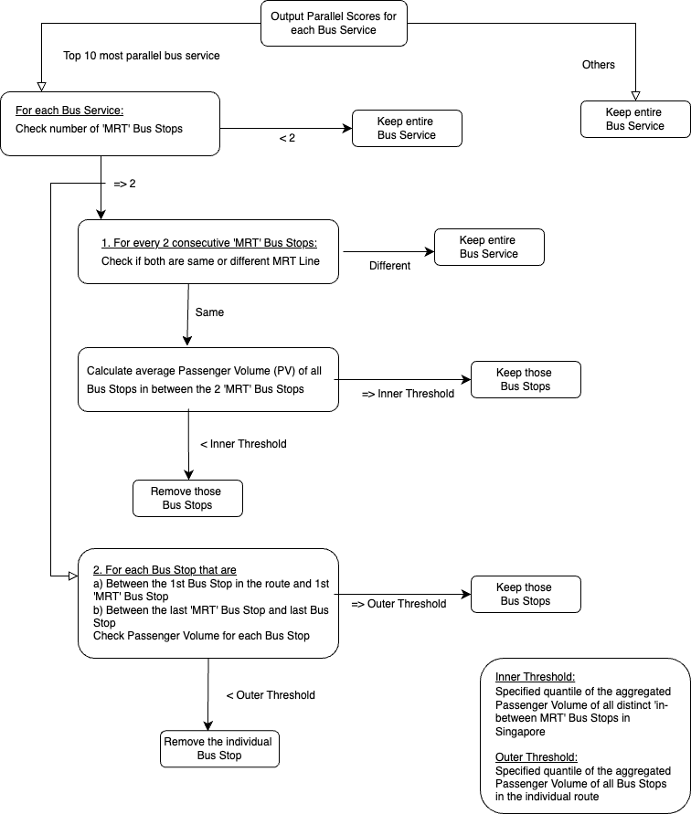

# Technical Report

**Project: LTA Geospatial Analysis**  
**Members: Eliza, Fang Ting, Krystal, Lily**  
Last updated on 29 October, 2024

## Section 1: Context

This project aims to detect trunk bus services with routes that overlap train lines so as to encourage commuters to use the MRT to get to their destination. Thereafter, we hope to remove redundant bus routes that duplicate train lines to a large degree or modify routes to cover places with less connectivity.

## Section 2: Scope

### 2.1 Problem

Currently, the problem lies in LTA introducing new MRT lines as an attempt to make public transportation more attractive to commuters. Before this, commuters relied trunk services as they cover relatively popular and long routes. Upon doing so, ridership for these trunk services dropped. As such, LTA would like to identify trunk services that are significantly parallel to MRT lines to be either removed or modified. Through streamlining transport options, budget can be utilised for other potential bus routes so that commuters can travel more conveniently.

Public transport can still be improved by identifying upcoming or current places that are experiencing a shortage of commute options. But, with a fixed amount of budget of $1 billion for buses assigned to LTA, funds have to be transferred in order to incorporate these changes. However, during the recent route rationalisation exercise for bus service 167, a service that overlaps significantly with the Thomson-East Coast Line (TEL), key opinions have mentioned that completely removing bus services can lead to more crowded buses for services that pass through MRT stations as commuters transfer to MRT. Furthermore, completely removing services can also deter commuters from taking public transport as a whole. We thus have to thread carefully and go beyond parallelism scores.

Data science is necessary in this problem as geospatial data has to be analysed. By displaying all current bus services against train lines and through thorough analysis of the popularity of bus services, we can construct a robust algorithm for parallel scores to identify bus routes that can potentially be removed or modified. The algorithm can be written based on factors such as how much it overlaps with train lines, how convenient the train ride is, and how many MRT stations the bus service passes through. Additionally, as mentioned above, it would be naive to simply use parallelism to decide if the bus service should be removed. Data science is thus also necessary in exploration and visualisation using datasets such as ridership to decide services that can potentially be modified or removed.

### 2.2 Success Criteria

#### Success Criteria 1:
Firstly, success would be achieved when our project identifies at least 2-3 bus routes that have significant overlap with MRT lines that can be modified. By targeting these parallel bus services, Land Transport Authority (LTA) can reduce operational costs and reallocate funds toward routes aligned with commuter needs. This improves LTA’s resource utilisation, ensuring that the funds are invested to maximise the value of the public transport system.

#### Success Criteria 2:
Another key measure of success is an increase in public satisfaction. By considering public sentiments when optimising route planning, bus services are catered to meet real commuter needs, leading to greater satisfaction and convenience and thus commuter experiences can be improved. An improved, demand-driven public network reflects LTA’s commitment to connecting people and places effectively, ensuring a positive perception of Singapore’s public transport system.

#### Success Criteria 3:
Lastly, our project’s success will be measured by the development of an adaptable, data-driven framework that LTA can apply to assess future MRT line expansions. This enables LTA to quickly evaluate the impact of new MRT lines on existing bus services, enabling faster, data-driven decisions for route planning and resource allocation. This allows LTA to meet the evolving commuter needs, ensuring a more efficient system that continues to be aligned with their vision of a people-centred transport system.

### 2.3 Assumptions

This project relies on several key assumptions that, if altered, could impact the scope, effectiveness or feasibility of our recommendations. 

#### Assumption 1: 
Firstly, we assume that redundant parallel bus routes are identified based not only on their bearing and proximity to MRT lines, but also on their connectivity to multiple MRT lines and coverage by other bus services. Specifically, a bus route that runs parallel to only one MRT line is considered more redundant than a route that acts as a connector between multiple MRT lines. Additionally, if a section of a bus route is served by multiple other services, modifying or removing that segment would have minimal impact on commuter satisfaction.

#### Assumption 2:
Given our reliance on publicly available datasets, we assume the data on bus stop coordinates and passenger volumes is both accurate and representitive. Inaccurate data could lead to incorrect route classifications, reducing the reliability of our parallelism scores and recommendations.

#### Assumption 3:
Lastly, we assume that LTA has enough budget and manpower to carry out the recommended changes. Limited resources could prevent LTA from implementing our findings, reducing the impact of our project.

## Section 3: Methodology

### 3.1 Data

#### 3.1.1 API Calls and Data Extraction
The datasets used were all obtained from [LTA DataMall](https://datamall.lta.gov.sg/content/datamall/en/dynamic-data.html) using API calls. To get the same datasets, run the notebook [API Calls and Data Extraction](<API Calls and Data Extraction.ipynb>). The table below displays all datasets called.

| Dataset    | File Type         | Description  |
|:------------:|:------------:|:------------:|
| `bus_routes.csv`  | csv |  Contains details of bus stops, routes, operators, stop sequences, and bus timings (first and last bus on weekdays and weekends) for each bus service. |
| `bus_stops.csv`  | csv | Contains bus stop codes, road names, bus stop names, and geographical coordinates for all bus stops in Singapore.  |
| `bus_services.csv`  | csv | Contains data on bus operators, service directions, categories (e.g., trunk, express), origin and destination stop codes, and bus frequencies during AM and PM peak hours.  |
| `mrt_lines_shapefile.shp`  | shp | Shapefile containing coordinates of MRT lines and stations for visualization. |
| `passenger volume by bus stops`  | csv | Contains hourly passenger volumes (tap-in/tap-out) per bus stop for weekdays and weekends for July, August, and September, along with day type and time period.  |

For our interface, we used [LTA's OneMap](https://www.onemap.gov.sg) to showcase our visualisations for all bus routes, MRT lines, proposed bus routes, and modified bus routes.

#### 3.1.2 Data Cleaning
After retrieving raw data, our first step was to filter for trunk services from `bus_services.csv`, and join ServiceNo to `bus_routes.csv` to create a new dataframe `trunkroutes`. Next, we cleaned the trunk routes by combining both directions of a bus service into a single continuous route. If the last stop of the first direction matched the first stop of the second direction, we removed the duplicate bus stop and updated the stop sequence of the second direction to make a single route. If the last stop of the first direction did not match the first stop of direction two, we update the stop sequence of the second direction immediately as there are no duplicate stops. Following this, we dropped the directions column to ensure a simplified representation of each bus service route.

#### 3.1.3 Feature Engineering
After cleaning the trunk routes, we created new features for each bus stop in the dataset. Our first feature is the average passenger volume, calculated for each bus stop. This is essential in identifying bus stops with high or low demands. We obtained the tap-in and tap-out data for each stop, summing the values across July, August, and September for both weekdays and weekends. The final average passenger volume for each bus stop was calculated as the mean of these monthly values.

Another feature was an indicator for whether a bus stop was an MRT station or not. A bus stop was defined as an MRT bus stop if its description contained ‘Stn’ or ‘Int’, but did not contain words like ‘Police’, ‘Fire’, ‘Railway’, which would indicate non-MRT bus stops.

Additionally, we defined which MRT line(s) each MRT bus stop belonged to. To do this, we created a mapping between MRT lines and their stations, including variations and short forms of station names to account for different naming conventions in the raw data. Using the find_mrt_line function, we checked each MRT bus stop’s name against the mapped MRT lines. If the bus stop name contained the station name from any MRT line, it would return the respective MRT line(s) associated with that bus stop.

### 3.2 Experimental Design

#### 3.2.1 Parallel Scoring 
To support LTA in evaluating trunk services that could be retained, modified, or removed, we developed a Parallel Scoring Method to rank these services by priority for review. This three-tiered approach helps identify trunk services that most closely parallel the MRT system, while also accounting for potential commuter feedback from service adjustments.
Our approach is as follows:

##### Tier 1:
For the first tier of the Parallel Scoring Method, we calculate the "parallelism" of each bus route relative to the MRT network. This metric evaluates how closely each bus route aligns spatially and directionally with MRT lines.

First, we load and group the MRT line data from the shapefile by MRT_LINE. A LineString is created for each MRT line by sorting the station points by sequence (STN_SEQUEN) and connecting their centroids. These individual LineStrings are then combined into a single MultiLineString (mrt_multiline), representing the entire MRT system.

We then defined the geospatial functions that will be used to calculate how near and how parallel a bus route is to the MRT System.
The haversine function calculates the geographic distance between two points, which is critical in determining proximity between bus and MRT segments.

The calculate_bearing function computes the bearing (directional angle) between two points, allowing us to measure alignment between bus and MRT line segments.

For each bus route, the calculate_route_parallelism function iterates over its segments.
For each segment: We find the nearest MRT segment using the minimum haversine distance and the bearing difference is computed between the bus segment and the nearest MRT segment, adjusting for cases where the difference exceeds 180 degrees.

Each segment receives a parallelism score inversely related to its distance from the MRT and bearing difference, this score is then weighted by segment length to moderate the effect of very long segments and derive the total parallelism score for a route.
The total parallelism score for a route is then normalised by the square root of its length, ensuring that longer routes don’t automatically receive inflated scores.

For each trunk bus service, the calculate_route_parallelism is applied, yielding a normalised parallelism score that reflects the route’s degree of alignment with MRT lines. These scores are then sorted in descending order, providing a ranked list of bus services based on their MRT parallelism, which supports prioritising bus services for evaluation.

##### Tier 2:
The purpose of Tier 2 is to refine the parallelism score by penalising bus services that run parallel to multiple MRT lines. This adjustment seeks to place lesser priority on buses that run parallel to multiple MRT Lines as a modification in such services might inconvenience commuters by having them change MRT Lines.
An MRT line segment is counted 'parallel' only if it encompasses a unique segment of at least eight consecutive bus stops within its buffer. This segment must not overlap with other MRT line buffers unless those buffers independently satisfy the “8 consecutive stops” rule.

We begun by creating a 1000 metres buffer around each MRT line by:
1. Sorting MRT stations by sequence
2. Constructing a LineString for each MRT line using sorted station coordinates
3. Creating a buffer for each LineString to represent a zone within which bus stops can be considered "parallel" to the MRT line

We loaded the data from Tier 1 and continued the Parallel Scoring Method by counting the consecutive stops of each bus service within the MRT buffers.
For each bus service, the process to identify segments that are parallel is as follows:
1. Each MRT line segment required a minimum of 8 consecutive bus stops within its buffer to be counted
2. If a segment of stops within a buffer overlapped with another MRT line, it was attributed solely to the primary MRT line
3. Overlapping segments reset their count for the secondary MRT line.

After tallying the number of MRT lines parallel to each bus route, penalties were applied based on the count of MRT lines that a bus service ran parallel to:
1. If a bus service paralleled only one MRT line, no penalty was applied.
2. As the number of parallel MRT lines increased, the penalty factor decreased the score incrementally.

This penalty function adjusted the Tier 1 parallelism score, producing a new Tier 2 Parallelism Score that accounts for proximity to multiple MRT lines
With the updated scores, services were re-ranked to reflect the impact of these penalties.

##### Tier 3:
Tier 3 inflates scores for services with common routes shared by other bus services.
For each bus service, we compare with  all other buses (Trunk, Express, Industrial, City-Link and Feeder) to count how many other buses services at least 30% of the stops in that particular bus service. 
The get_counts function iterates through each service and identifies how many other services share at least 30% of its stops.

For each service, the code creates a set of bus stops, then calculates the intersection with stops for other services, resulting in a proportion value. If another service shares more than 30% of stops with the target service, we increment the count for that service, reflecting its degree of overlap with other routes.

The get_step3_parallel_score function takes the original parallelism score from Tier 2 and applies an adjustment based on the overlap count obtained from bus_stop_counts.
If a service has 1, 2, or 3+ overlaps above the 30% threshold, the ParallelismScore is multiplied by a factor of 1.1, 1.2, or 1.3, respectively. If there is no significant overlap, the score remains unchanged.
This adjusted score is then sorted and ranked, allowing services with higher overlaps to be prioritised in the list.

The result is ranked list where bus services with a higher overlap with other routes have inflated scores while services parllel to more MRT Lines are penalised, indicating higher priority for potential modification.
This method allows us to focus on routes that are parallel to the MRT without significantly impacting commuter satisfaction.

#### 3.2.2 Modifying Bus Routes
To assess the redundancy of bus stops on the top 10 parallel routes, we developed a methodology that uses bus stop passenger volume thresholds to determine whether stops should be kept or removed. The main stages of this process, as outlined in our flowchart, include evaluating passenger volumes both between consecutive MRT stops (using an "Inner Threshold") and at stops located at the edges of the MRT connectivity zones (using an "Outer Threshold").

In this methodology:
Inner Threshold is applied to assess stops between MRT stations on the same line, removing stops with low passenger volumes. Outer Threshold is used to assess stops outside the MRT Bus Stop boundaries, emoving stops with low passenger volumes.

This process is explained further in Section 4.3 - Recommendations, where we explain the purpose and implementation of each threshold, along with the functions used. 

For a clear visualization of this workflow, refer to the flowchart provided

#### 3.2.3 Interface
Our interface is designed using a combination of Python, Java, and JavaScript. The backend was built entirely in Python, where we exposed it as a REST API using the Flask framework. All backend code can be found in `app.py`. This backend was then intergrated into our `Spring boot` application, which is written in Java. All visualisations were convered into `GeoJSON` format to enable communication between the Flask API and the Java backend, specifically within `BusController.java` and `BusVisualisationService.java`.
For the fronten, we used React.js, written in JavaScript to interact iwth the APIs. The frontend code resides in `BusRouteSelector.js` and `App.js`. Users can interact with the interace via the development server at `http://localhost:3000` once started up.

Instructions and pre-requisites for starting the interface and be found in our `README.md`.

##### API Endpoints

The table below lists the API endpoints used for interaction between the backend and frontend. The endpoints facilitate retrieving and plotting bus routes, propsed bus rotues, modified bus routes, and train lines on the map, along with computing parallelism score and rankings.

| Method    | Endpoint          | Request Body  | Response |
|:------------:|:------------:|:------------:|:------------:|
| GET  | `/bus_routes` | - | List of bus routes once user clicks on dropdown menu|
| GET  | `/proposed_routes` | - | List of proposed bus routes once user clicks on dropdown menu|
| GET  | `/modified_routes` | - | List of modified bus routes once user clicks on dropdown menu|
| GET  | `/train_lines` | - | Trains lines visualisation on leaflet map|
| POST  | `/plot_routes`   |  `service_no:` `String`|geoJSON data of bus route coordinates plotted onto map|
| POST  | `/plot_proposed_routes`   |  `service_name:` `String`|geoJSON data of proposed bus route coordinates plotted onto map|
| POST  | `/plot_modified_route`s   |  `service_no:` `String` |geoJSON data of modified bus route coordinates plotted onto map|
| POST      | `/parallel_score`   | `service_no:` `String` | Normalised parallelism score of bus routes with mrt lines appears |
| POST      | `/rank` | `service_no:` `String` | Rank of parallelism score of bus routes with mrt lines appears |

##### Basic System Architecture
Below is a basic system architecture we created and referenced when building our interface.

##### Overview of Interface
Below is how our interface looks like. Drop down menus for bus routes, modified bus routes, and proposed bus routes display all routes according to category. Selecting a bus service displays the route on the map. When selecting bus routes from the first drop down menu, parallel score and ranking appears too. Train lines can be darkened to view bus routes against train lines at a more macro scale. If not, the map itself has dotted train lines and train stations when zoomed in. However, it is not as observable but can be used if the user wants to look more closely to inspect MRT stations the selected bus service goes through.

### 3.3 Technical Assumptions

#### Assumption 1: 
Publicly accessible data limitations prevented us from obtaining exact ridership data for specific bus services. Instead, LTA DataMall provides "Passenger Volume by Bus Stop" which indicates passenger volumes at a given bus stop at specific hours of a weekday or weekend in each month. Additionally, DataMall only allows for calls on Passenger Volume by Bus Stop for the past three months, restricting our passenger volume data to July, August, and September of 2024. 

The available data records only tap-ins and tap-outs, without distinguishing between passengers ending their journey and those transferring to another bus service. Therefore, the aggregate number of tap-ins likely overestimates the actual number of commuting journeys, and similarly, tap-outs likely overestimate the count of passengers with final destinations near the respective bus stop. 

We assume that passenger volume at a given bus stop reasonably reflects the ridership of bus services that serve it. We acknowledge the limitation in this assumption, as each bus stop typically serves multiple bus services and ridership may be overstated when popular services contribute disproportionately to volume. 

Consequently, our evaluation of bus routes did not solely rely on ridership data when considering whether a route should be kept, modified or removed altogether. Our prioritisation of trunk bus routes follows a three-tiered approach, detailed in Section 3.3.

#### Assumption 2:
Our project also assumed a specific criteria to define when a section of a bus route qualifies as “parallel” to an MRT line in the second tier of calculating parallel scores. We defined a bus route segment as parallel if it falls within a 1km buffer zone around the MRT track and contains at least 8 consecutive bus stops within this buffer. Such a segment would be flagged as parallel and we would record which MRT line it corresponds to. 

We acknowledge that setting a threshold of 8 consecutive stops may vary in impact depending on the route length of each bus service; longer routes are more likely to meet this criterion, while shorter routes are less likely to do so. However, the aim of this parallel identification is to account for the extent and nature of MRT parallelism across bus routes, with a penalty applied to routes that align with multiple MRT lines. This approach helps differentiate longer bus routes, which are inherently more likely to intersect with multiple MRT lines, from shorter routes that may align with only one or no MRT lines.

#### Assumption 3:
In the third tier of calculating parallel scores, we assumed that buses that cover more than 30% of the bus stops in a bus service would be classified as having a similar route, making that bus service more common. Under this assumption, services with common routes could be reasonably considered for modification, as commuters would have alternative options along these shared paths. The threshold of 30% was selected based on our own experimentation with the dataset and concluded that this threshold best reflected similarity between bus routes. We recognise that this threshold may impose a limitation on shorter routes, as these inherently cover fewer stops and are less likely to meet the threshold to be classified as “similar.” 

However, the intent of this threshold is to highlight bus services with significant overlap, whose modification would be less likely to disrupt commuters due to alternative options. Although shorter routes fall outside this threshold, their exclusion is acceptable, as these routes generally serve more localised areas and are less likely to act as substitutes for other bus services.

## Section 4: Findings

### 4.1 Results

We found that routes with high parallelism scores tend to:
  1. Serve densely populated and high-demand corridors particularly in the corners of Eastern and North-Eastern regions where MRT stations are getting more accessible as well as Central to Northern regions       with a high volume of different bus services.
  2. Have parallelism scores that are generally lower in the Western region, with routes either running shorter distances or overlapping with multiple MRT lines, leading to diluted parallelism scores.
  3. Exhibit longer total route distances, often mirroring the trajectory of MRT lines over extended stretches without significant deviations.
  4. Operate with frequent service intervals, likely responding to high ridership demand along these parallel paths.

On the opposite end, trunk routes with scores below 0.2 are often feeder routes or those with unique trajectories, serving specific areas without MRT overlap. These results indicate that a smaller proportion of trunk bus services are tailored to provide access to areas that MRT lines do not directly serve but help to bridge connectivity gaps in the network.

With our definition of parallel routes, our tri-part parallelism score model identified bus routes 966, 63, and 31 as the most parallel to MRT lines, achieving the highest relative parallelism scores of 1.0, 0.98, and 0.93, respectively. These routes exhibit a strong alignment in direction and proximity with specific MRT lines, particularly maintaining consistent bearings and minimal deviations from the routes taken by these rail lines. Additionally, they are primarily aligned with only one or two different MRT lines, which reduces route complexity and makes them highly comparable to specific MRT services. They exhibit a high degree of overlap in bus stops with other services, making them easily replaceable with many available alternative bus services that could be taken.

These findings were integrated with GIS mapping tools for visualizing transit redundancies or gaps in underserved areas. Our interactive SHAP visualizations and parallelism score maps created during this project allow transportation authorities to make data-driven decisions to optimize route configurations further.

#### Bus Route 966:

#### Bus Route 63:

#### Bus Route 31:

Out of over 400 evaluated routes, only a small fraction (approximately 5%) achieved a parallelism score above 0.8, underscoring that true MRT-bus parallelism is relatively rare across the network. The majority of routes showed scores below 0.5, suggesting that most bus routes operate in corridors that are less directly served by MRT lines. This distribution hints at complementary rather than competitive positioning of most bus routes relative to MRT services. The clear identification of high-scoring routes provides transit authorities with a targeted set of routes for further study and potential adjustments.

### 4.2 Discussion

### 4.2.1 Interpreting the Results and its Impacts
The final scores and rankings prioritise trunk services for further evaluation, streamlining the process and reducing the need for manual review of individual services. The ranking system is structured around key criteria:
1. Degree of parallelism with the MRT network
2. Higher priority for routes that parallel fewer MRT lines
3. Higher priority for routes that share significant overlap with other bus services
This scoring methodology ensures that modifications focus on services with high MRT parallelism while minimising potential public resistance to changes.

In addition, the interface offers an accessible platform to visualise and analyse existing routes, displaying each service's rank and Parallel Score. This metric, as calculated by the algorithm, helps facilitate decision-making in service adjustments.

### 4.2.2 Significance of key features of the model

##### Step 1 

Firstly, using just geospatial functions calculating geographic distance between bus routes and MRT line segments as well as the bearing between the us routes towards MRT lines, the parallelism score depicted bus 63, 961M and 48 as the most parallel buses, in order of rank. These buses were treated as a benchmark/baseline routes before further modification. 

##### Step 2

As a second layer, trunk bus routes that intersect multiple MRT lines were identified as particularly advantageous for commuters, as these routes offer reduced travel times compared to solely relying on longer, singular MRT journeys. Such bus routes are valuable because they function as expedited alternatives, effectively connecting various MRT lines and creating shorter travel paths. Therefore, these routes should be assigned lower parallelism scores and prioritised for retention.

After implementing this refinement, the top three bus routes with the highest parallelism scores became 966, 63, and 858, respectively. Notably, bus 966 experienced a substantial elevation in ranking, moving from 26th to 1st place, while bus 858 rose from 50th to 3rd place. This significant reordering suggests that many of the trunk bus services initially flagged for high parallelism with MRT lines were, in fact, essential components of the transit network. These buses offer valuable interconnections across different MRT lines, serving as effective shortcuts or faster alternatives to fixed MRT routes, being a significant feature of our model.

##### Step 3
Finally, trunk routes that are highly irreplaceable are those with few alternative bus routes serving similar stops and should receive lower parallelism scores, warranting their retention. Such routes are essential for commuters who depend on these specific services due to the lack of alternative options to navigate the same path effectively.

Following this refinement, the top three bus routes with the highest parallelism scores were 966, 63, and 31. Notably, there was no shift in the 1st and 2nd rankings of routes 966 and 63, as observed in the previous stage. However, bus 31 moved up from 5th to 3rd place, likely due to its status as a popular route intersected by other bus services, which increases its substitutability relative to other trunk buses. The minimal change in rankings, especially in the top 10 trunk services, between steps 2 and 3 suggests that the popularity of a bus route does not significantly impact parallelism as compared to intersecting multiple MRT lines in the previous stage. Nevertheless, this final adjustment served to effectively identify trunk bus routes that are parallel to MRT lines and, as such, may be considered for removal or modification.

#### 4.2.3 Potential Biases in the Model
Several potential biases may emerge from employing the three-step approach in calculating parallelism scores.

##### Bias 1: Bearing Similarity
There could potentially be an overemphasis with directional consistency. The emphasis on bearing similarity may disadvantage routes that do not strictly align directionally with MRT lines due to road network constraints or urban layout. In dense urban areas or complex suburban layouts, road infrastructure often requires bus routes to take winding or indirect paths to serve neighborhoods, shopping centers, and other key destinations. These routes may still operate within the same transit corridor as an MRT line but appear less parallel because of necessary turns or adjustments to serve local demand. Routes that are more winding and take frequent turns to access residential or commercial areas receive lower scores, even if they effectively serve the same transit corridors as MRT lines. 

##### Bias 2: Multi-Line Consistency 
Routes that facilitate transfers between MRT lines or provide crosstown connectivity may be over-scored, despite their essential role in improving network flexibility. Stations with high MRT line densities may appear to have high parallelism scores indicating parallelism to limited MRT lines yet serve broader connectivity needs. For instance, Outram Park MRT station serves as a connection between 3 different MRT lines: Thomson-East Coast Line, North-East Line and East-West Line. A bus that travels parallel to the East-West Line receives a higher parallelism score without taking into account stations such as Outram Park that can increase assesibility to other MRT lines, and should be scored lower.

##### Bias 3: Bus Stop Overlap
Routes passing through high-traffic stops near MRT stations or central transit areas may receive inflated parallelism scores due to frequent stop overlap. This bias is particularly pronounced in densely populated urban centers, where high stop overlap can give an inaccurate representation of a route’s functional redundancy with MRT services; their parallelism score can be inflated depending on the length of the entire route. Routes that are much shorter and go through multiple popular bus stops would be overscored yet primarily serve densely populated areas not covered by MRT, rather than assessing their unique transit contributions. This results in overvaluation of long-distance routes that partially overlap with MRT lines, even if a large segment of the route aligns and are parallel with MRT service areas.

##### Bias 4: Lack of Demand-Sensitive Scoring 
The current scoring process does not incorporate ridership data or information about actual passenger demand, which could lead to inflated parallelism scores for routes that follow MRT lines yet still experience high utilization by commuters. Without considering demand, the model may inadvertently overvalue routes that appear redundant on the basis of route alignment but, in practice, fulfill a distinct role in the transit network due to high passenger usage.

### 4.3 Recommendations

#### 4.3.1 Modified Routes
To handle the top 10 most parallel bus routes, we propose a methodology that evaluates the necessity of the bus stops along those routes. This approach aims to identify redundant segments along these routes, freeing up resources for better resource allocation.

1. Define Thresholds for Bus Stop Retention
We implemented two threshold criteria based on average passenger volumes:
- Inner Threshold: This threshold is applied to bus stops between two MRT stations on the same line. Stops below this threshold are likely redundant due to MRT connectivity. This threshold is calculated using the create_inner_threshold function, which aggregates passenger volumes for all distince in-between stops across Singapore and derives a value based on a specified quantile.
- Outer Threshold: For stops located outside the initial and final MRT stations on a route, evaluating their utility as feeder points. This threshold is calculated using the create_outer_threshold function, which aggregates passenger volumes for all stops on each route individually.

2. Process Bus Routes to Keep or Remove Bus Stops
Our process_bus_routes function uses these thresholds to label each stop as "keep" or "remove" based on its passenger volume. Specifically:
- For stops between MRT stations on the same line, the inner threshold is applied. If the average volume of the in-between stops is higher than the threshold, stops are kept. Else, it is removed
- For stops outside MRT boundaries, the outer threshold is applied. If the average volume of each stop is higher than the threshold, stops are kept. Else, it is removed

3. Next Steps for Implementation
We applied this method for the top 10 most parallel bus services identified using our parallelism scores. This produced a modified dataset (new_top_10_bus_data) where each stop is classified for retention or removal. Additionally, we produced top_10_buses_new_routes_only, focusing solely on routes where modifications were recommended.

We recommend deploying this methodology as an assessment tool integrated with real-time passenger data, enabling LTA to regularly evaluate the relevance of bus stops in relation to MRT lines. This will allow LTA to respond to public demand effectively, while cutting operational costs and increasing public satisfaction.

Furthermore, ensuring high data quality, particularly for passenger volumes, is crucial to avoid improper stop removals. Incorporating real-time or predictive data on passenger flow would further enhance accuracy, allowing LTA to refine resource allocation based on evolving commuter needs.

This method could be significantly enhanced with access to passenger volume data specific to each bus service. By capturing the unique passenger load for each bus and the individual stops they service, we could achieve a more precise assessment of each route’s utility. This would allow LTA to fine-tune their decisions, ensuring that routes are modified based not only on bus stop volumes but also on the demand of different bus services.

#### 4.3.2 Proposed Routes
In line with the project’s Scoping Document, identifying bus routes for potential removal or modification could free up funding for three proposed new routes addressing public demand. 
Here, we outline three suggested routes:

##### Proposed BTO Route
With the increasing number of BTO projects across Singapore, it’s essential to consider the needs of residents in newly developed areas. Backlash from Tengah residents in its early stages highlighted a lack of public transportation options and a disconnect with central areas. In response, we focus on Singapore's largest 2024 BTO development, Tanjong Rhu Riverfront I & II, with 2,063 units. Located along Tanjong Rhu Road, the nearest bus stop, 'Opp S'pore Swim Club,' is currently served by only two bus routes, 158 and 158A, covering Geylang, Joo Seng, and Serangoon.

We propose a dedicated bus route to better connect these over 2,000 residents with popular central areas, using the Passenger Volume by Bus Stop dataset to prioritise stops with high demand. Since many residents are likely to be working adults, this route would provide a more efficient commute by linking directly to bus stops in the CBD, reducing the need to transfer buses or MRT lines.
